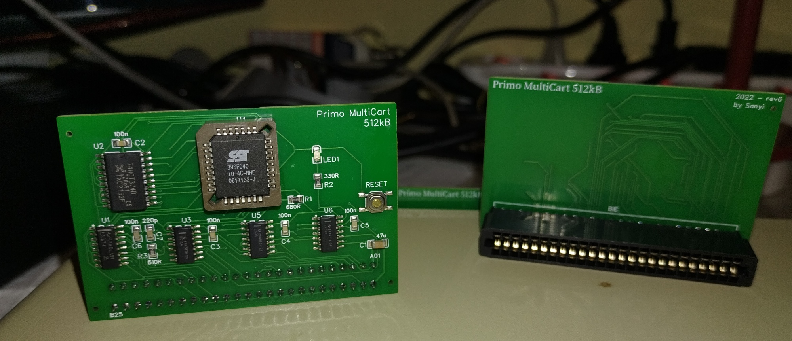

# Primo-Multicart512kB

This is the repository of the 512kB MultiCart for the Hungarian 8bit computer Primo. The https://oshwlab.com/vass.sanyi/primocart link also contains 
the hardware source, but you may get it directly from here (which you have to import into your EasyEDA editor).
This repo contains all the necessary information to build one (or more) cartridges for yourself.

Ez a repo a Primo 512kB-os Multicart összes forrását és gyártásához szükséges file-okat tartalmazza. A hardware forrásokat a 
https://oshwlab.com/vass.sanyi/primocart URL -en is megtalálhatod, de innen is letöltheted (csak utána be kell importálni az EasyEDA editorba).

A binaries könyvtár tartalma:
- mcromgen.exe - ez a lefordított eeprom kép-generátor program, windows alatt fut. A bemenete egy helyesen kitöltött .plst file - aminek egy templétje szintén ebben a könyvtárban található. A .plst file formátumát a template-ben megtalálhatod.
- firmware-boot.bin - ez bináris a lefordított firmware, ami gyakorlatilag elindul, kirajzolja a .plst file által leírt menüt és elindítja a kiválasztptt programot / ROM -ot.
- Két példa image, amik már egy-egy legenerált, teljes ROM image -ek. Ezek egyikét beleírva az 512kB -os EEPROM -ba, a kártya teljesen működőképes. (OG és VG a lista összeállítóinak a monogrammja). A két példa egyébként nagyrészt átfedésben vannak, nem készült ám olyan sok játék Primora...

A gyártáshoz a gerber file mellett megtalálható a BOM és a placement file-ok is. A lapok szélein a furatok az SMT beültetés miatt vannak, illetve az élcsatlakozó alatt ott van a 'JLCJLCJLC' string is, ami a gyártási szám helyét jelöli (nekik kell, nem nekünk). Felforrasztott élcsatlakozóval ez az ID nem fog látszódni.
A MultiCart használatához el kell távolítani a Primo hátlapját, mivel az eltakarja a csatlakozási pontot. 4 csavart kell kicsavarni, majd a takaró lemezt simán kiemelni (és persze visszacsavarozni mindent a helyére). Ez nem bonyolult, egy sima, egyenes csavarhúzó kell hozzá.

Ha magadnak készítesz listát, akkor a következő képpen kell megírnod az EEPROM-ot:
- $0000 címtől kezdve kell rá felírni a firmware-boot.bin tartalmát
- $1000 címtől kezdve kell rá felírni az mcromgen által generált bináris file-t (aminek kiterjesztése alapesetben .mcrom)

A sources könyvtár tartalma:
- firmware - ebben a könyvtárban van a firmware-boot.bin file forrása. Én ezt anno az ASM80.COM címen található online z80 IDE -vel készítettem, nem tudom, h most elérhető-e.
- hardware - Az exportált kapcsolási rajz és nyákterv az EasyEDA online IDE -jéből. Ez az, ami megtalálható a fenti oshwlab webcímen is.
- imagebuild - Ez az imagebuilder pascal forrása. Ezt Lazarusban készítettem. Ha akarod, magadnak lefordíthatod Linux -ra, Max -re is. Win32-re fordított futtatható bináris megtalálható a binaries könvytárban.

## A működésről néhány szóban
Ez a verzió (v1.10) már felismeri és kezeli a Primo különböző memóriakonfigurációjú gépeit. Figyelem!! A kártya RAM-ot nem tud bőviteni, azaz egy A32-es gép (16kB RAM) nem fog tudni betölteni egy 17kB -os programot továbbra sem!!
A kártyán található LED akkor világít, ha a kártyán található EEPROM használatban van (pl lista betöltéskor villog, mert az egyes listaelemeket egyesével tölti be, vagy ha egy ROM-ot indítunk, akkor a LED világít, hiszen az van kiválasztva használatra).
A kártyán található RESET gomb a Primo gépet reseteli és nem a beépített NMI híváson keresztül, hanem valódi, hardver reset történik.

A generált listában többféle program kaphat helyet:
- ROM image: ez ugye a Primo ROMját tudja lecserélni (A típusú gépben mondjuk B típusú ROM-ra) anélkül, hogy cserélni kellen a ROM-okat az alaplapon
- ptp file: ez egy szalag kép, akár több programmal. Ebből csak egyet tud betölteni a multicart. Vagy az első betölthető állományt, vagy a .plst file-ban kiválasztottat (lásd: template-ben a leírást!)
- pri file: ez pedig egy sima program file

Arra is lehetőség van, hogy egy program futtatása során a Primóban aktuális ROM-ot lecseréljük (azaz mondjuk A64 gépünk van, de B ROM kell a programhoz). Ekkor SPACE-el kijelöljük a kívánt ROM képet, majd a programot elindítjuk a szokásos RETURN gombbal. Nyilván elindíthatjuk a kiválasztott ROM-ot is a RET gombbal, de akkor ugye nem tölt be semmilyen programot, arról magunknak kell gondoskodni.

A listában éredemes a ROM file-okat előre helyezni, onnan könnyebben lehet azokból választani.

Lehetőség van arra is, hogy ne használjuk multicart nyújtotta lehetőségeket, ekkor a BRK gombot kell megnyomni és ilyenkor a Primo elindul úgy, mintha nem lenne a MultiCart bedugva.

A listában a nyilakkal vagy az AY és ÉÁ gombokkal lehet navigálni.

